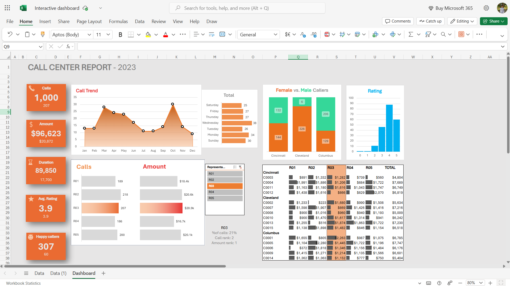

# InteractiveDashboard-Excel
This project is built using **Microsoft Excel** to track and visualize key performance metrics of a fictional Call Center for the year 2023.

---

## 🔍 Overview
The dashboard presents a **comprehensive summary** of call center operations, including:

- 📞 **Total Calls**
- 💵 **Revenue (Amount)**
- ⏱️ **Call Duration**
- ⭐ **Average Rating**
- 😊 **Happy Callers**

All these data are connected to a slicer where user can manually switch between different representative to see their respective metrics.
---

## 📈 Key Features

- 📅 **Monthly Call Trend**:
  - Area chart showing call volume variation across months.
  
- 🧑‍🤝‍🧑 **Gender-wise Caller Breakdown**:
  - Stacked bar chart comparing Male vs. Female callers across cities.

- 📊 **Call Ratings Distribution**:
  - Vertical bar chart depicting call satisfaction ratings (1 to 5).

- 🔍 **Representative Slicer (R01 to R05)**:
  - Selecting any one of them filters the entire dashboard to show metrics related specifically to that representative — including total calls handled, average handling time, customer satisfaction, and more.

- 🏙️ **City-wise Caller Performance Table**:
  - Detailed matrix showing revenue per representative across 3 cities: Cincinnati, Cleveland, and Columbus.

---

## 🛠 Tools & Techniques Used

- Microsoft Excel 365
- Pivot Tables
- Pivot Charts
- Slicers
- Conditional Formatting
- Custom Cell Formatting
- Data Validation & Dynamic References
      
---

## 🎯 Purpose

This dashboard project was developed as part of a **Business Analyst portfolio** to showcase:

- Data storytelling & visualization skills
- Interactive reporting
- KPI tracking
- Advanced Excel techniques

---
